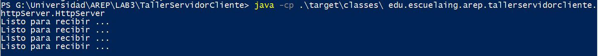
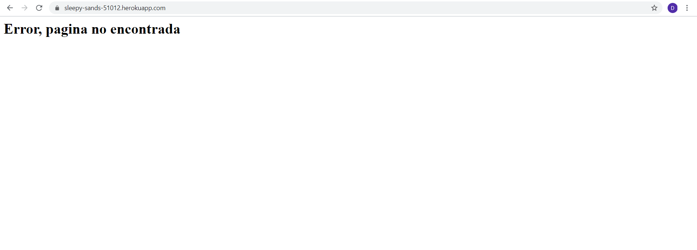
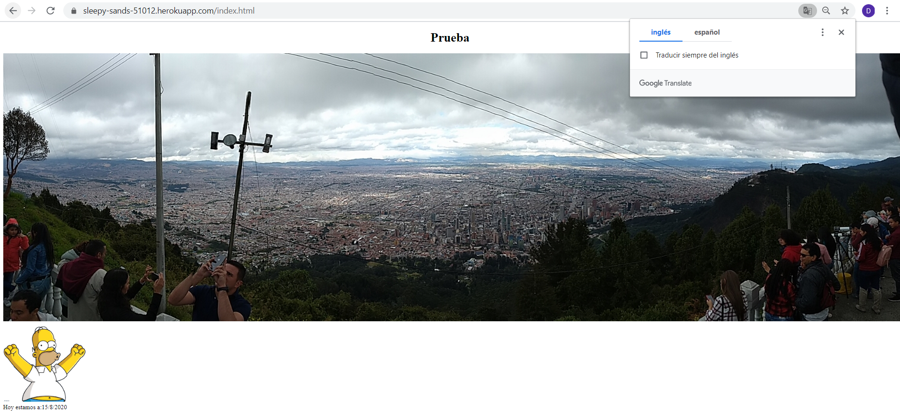
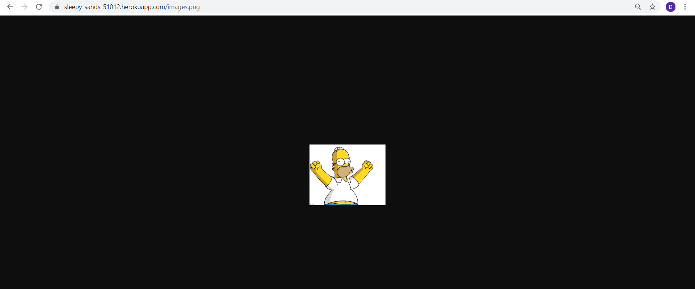
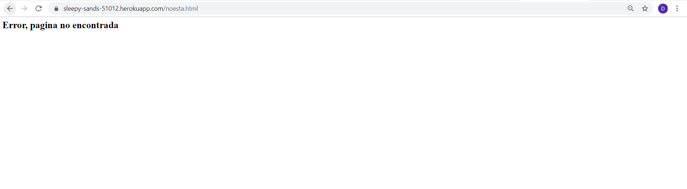
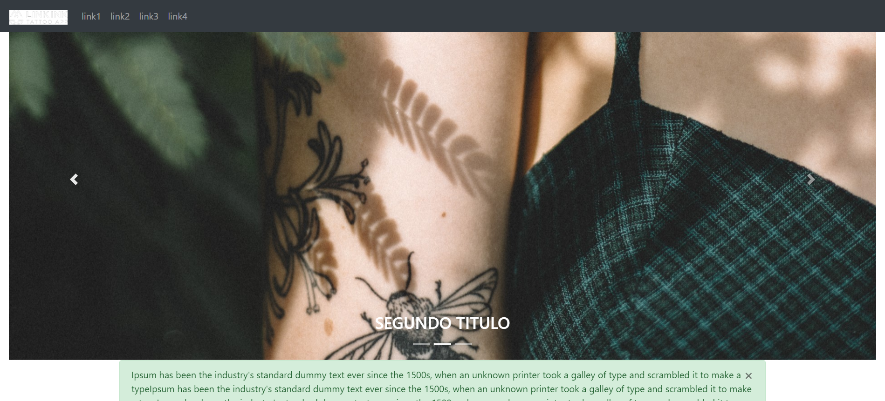
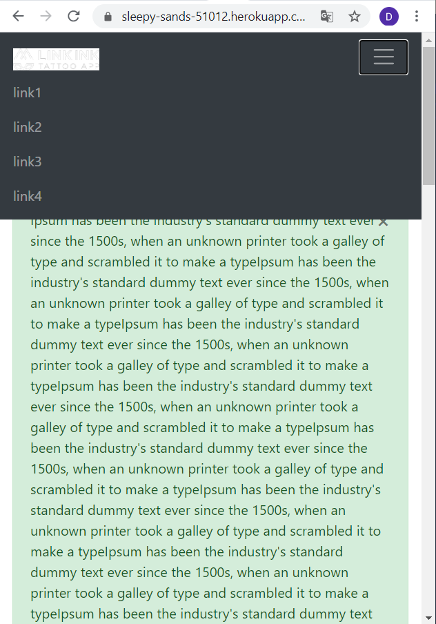

# Autor: Daniel Felipe Alfonso Bueno

# Profesor: Luis Daniel Benavides
# AREP - Arquitectura Empresarial
## Prerrequisitos
Se debe tener instalado JAVA JDK 8 o superior y MVN.

## Despliegue en Heroku
[¡Aplicación desplegada en Heroku!](https://sleepy-sands-51012.herokuapp.com/)

## Diseño
En el archivo AREP Design podremos encontrar la metafora de diseño, la explicación del modelo de clases. 

## Uso del proyecto
Para ejecutar nuestro proyecto, procederemos a clonarlo del repositorio de GitHub en el siguiente link https://github.com/DanielAlfonso17/AREP-LAB3.git desde la terminal de comandos de la siguiente manera
~~~
git clone https://github.com/DanielAlfonso17/AREP-LAB3.git
~~~

Después nos movemos al directorio donde está ubicado nuestro proyecto y en consola ejecutamos mvn para compilar

~~~
mvn package
~~~

Podemos genera la documentación del proyecto con el comando
~~~
mvn javadoc:javadoc
~~~
El archivo de documentación se encuentra en la raiz del repositorio con nombre Documentacion.html

Podemos ejecutar localmente nuestro proyecto con el siguiente comando en consola: 
~~~
java -cp .\target\classes\ edu.escuelaing.arep.tallerservidorcliente.httpServer.HttpServer
~~~

Los archivos que podemos solicitar a este webServer son los siguientes:
- bart.jpg
- imagen.jpg
- images.png
- index.html
- index1.html
- prueba.html
- paginaEscuela.html

Podremos observar que cualquier archivo que solicitemos y no este en la lista anterior, nos devolvera un error 404 Not Found. Si deseamos agregar mas archivos, podremos hacerlo 
localmente añadiendo las fuentes html,css,js, png o jpg al directorio estatico del proyecto: src/main/resources

Como no estamos solicitando en la URL ningun archivo que exista, entonces nos mandara error 404 

Como podemoso observar los archivos web html, las imagenes, los js y archivos de estilos css se renderizan de manera correcta 
